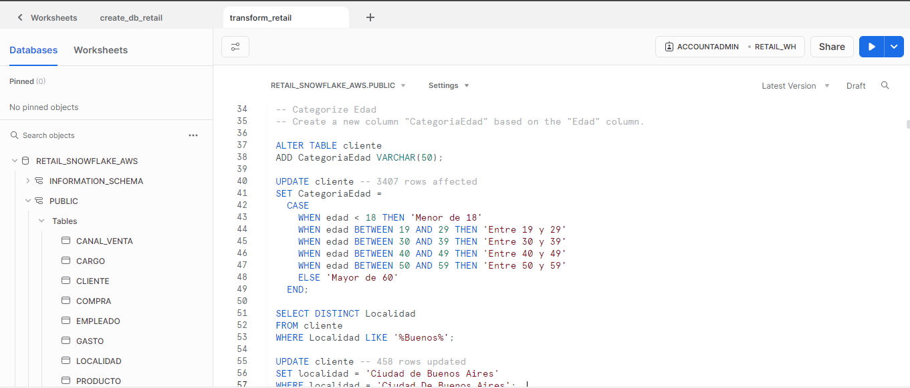
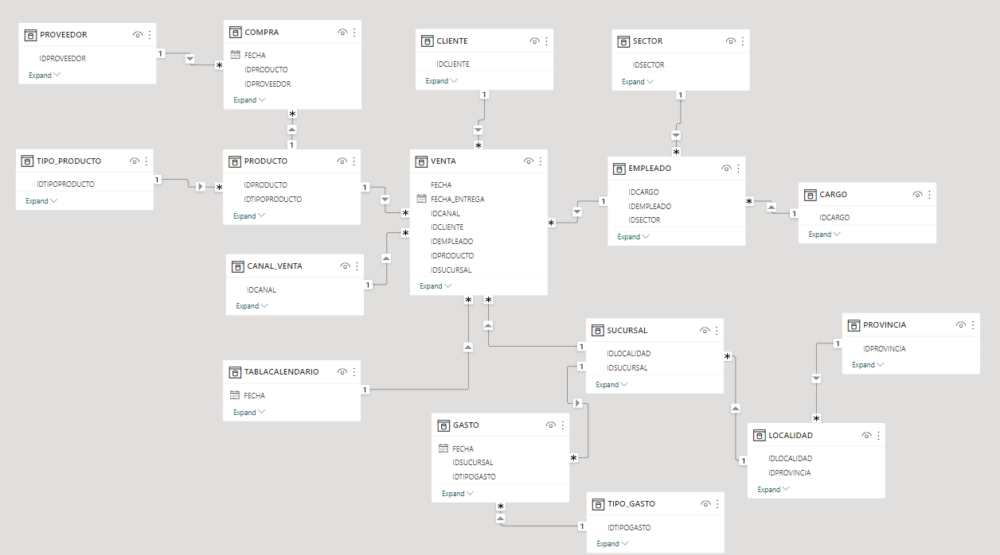
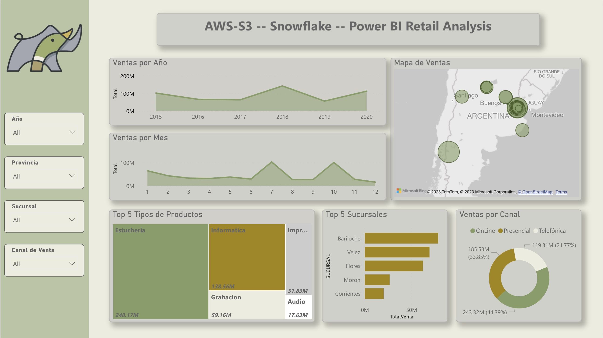

# Building a Data Ecosystem with Snowflake and AWS-S3 <br> Retail Company Analysis

Para la versión en español, click [aquí](README_es.md)

## Project Overview

In this comprehensive data engineering project, we meticulously constructed a powerful data ecosystem utilizing AWS-S3 as a data lake and Snowflake as a data warehouse. Our primary objective was to integrate and transform diverse datasets from an electronic equipment store, encompassing sales, customer information, supplier details, and product data. Through meticulous ETL processes and powerful SQL transformations, we normalized the data, ensuring its integrity and coherence.

## Dataset Insights

Our dataset encompassed ten distinct tables, spanning both CSV and XLSX formats. Each table encapsulated vital aspects of the business, ranging from sales channels and customer demographics to detailed purchase records and supplier information.

### Key Tables:

- **Canal Venta**: Insights into varied sales channels.
- **Clientes**: Comprehensive customer profiles.
- **Compra**: Detailed transaction records, including branch-specific data.
- **Empleados**: Employee data, including roles and responsibilities.
- **Gasto**: Records of fixed expenses incurred by branches.
- **Productos**: Comprehensive product catalog.
- **Proveedores**: Supplier details associated with store products.
- **Sucursales**: Information about the store branches.
- **Tipos de Gasto**: Categorization of different types of expenditures.
- **Venta**: Transactional data related to sales made at store branches.

## ETL Process: Data Ingestion and Transformation

<p float="center">
  
</p>


Our ETL (Extract, Transform, Load) process was meticulous and systematic, ensuring data quality, consistency, and coherence. Key transformations performed in Snowflake included:


### Data Ingestion from CSV to AWS S3

1. **Uploading CSV Files**: The first step involved uploading the CSV files to an AWS S3 bucket. This was done using the AWS Management Console, AWS CLI, or any other preferred method for uploading files to S3. The detailed steps are in [loading_aws.sh](loading_aws.sh) script.

   ```bash
   aws s3 cp local_file_path s3://bucket_name/
   ```

2. **Setting Up AWS S3 Bucket**: Ensuring proper bucket configurations, including permissions and access control, was crucial to secure the data and enable smooth ingestion.

### Staging Data in Snowflake

1. **Snowflake Stage Creation**: In Snowflake, a stage was created to point to the specific S3 bucket and folder where the CSV files were stored. This stage acted as an intermediary location for data transfer.

   ```sql
   CREATE STAGE my_stage
   URL='s3://bucket_name/folder/'
   CREDENTIALS = (AWS_KEY_ID='my_aws_key_id' AWS_SECRET_KEY='my_aws_secret_key')
   FILE_FORMAT = (TYPE=CSV FIELD_OPTIONALLY_ENCLOSED_BY='"');
   ```

2. **Copying Data from Stage to Snowflake Tables**: Utilizing Snowflake's `COPY INTO` command, the data from the staged files was copied into Snowflake tables.

   ```sql
   COPY INTO target_table
   FROM @my_stage/file_name.csv
   FILE_FORMAT = (TYPE=CSV FIELD_OPTIONALLY_ENCLOSED_BY='"')
   ON_ERROR = 'CONTINUE';
   ```
    The details of database and table creation can be found in the [snowflake_db_creation.sql](snowflake_db_creation.sql) file.

3. **Data Transformation in Snowflake**: After ingestion, various transformations, such as data cleansing, schema normalization, and column type conversion, were performed directly in Snowflake using SQL queries. These transformations ensured that the data met the required quality and structure standards. Some of the transformations performed are:

- **Standardization of Sales Channels**: Ensuring consistency by removing unnecessary columns and renaming fields.
  
- **Customer Data Refinement**: Formatting geographical coordinates, renaming customer IDs, and creating dimension tables for locality and province.
  
- **Job Title Normalization**: Creation of a comprehensive job title dimension table.
  
- **Purchase Optimization**: Establishing connections with suppliers and products, enhancing data integrity.
  
- **Employee Data Enrichment**: Creation of an auto-incremental EmployeeCode to avoid duplicate EmployeeId. Standardizing branch names for precise matches.
  
- **Expenditure Enhancement**: Creation of a detailed expenditure type dimension table.
  
- **Spatial Data Refinement**: Standardizing latitude and longitude values and creating a comprehensive branch dimension table.
  
- **Temporal Dimension Creation**: Implementing a custom procedure to construct a robust calendar table spanning multiple years.

    The details can be found in the [snowflake_transformation.sql](snowflake_transformation.sql) file. 

## Architecture

We decided to create a Snowflake schema. The Snowflake Schema extends the Star Schema by further normalizing dimension tables. In this schema, dimension tables are organized into multiple related tables, creating a snowflake shape when diagrammed. Each level of normalization reduces redundancy at the cost of increased complexity.
Among its advantages we can highlight:
- Space Efficiency: Reduces redundancy, thus saving storage space, which can be significant for large datasets.
- Data Integrity: Normalization ensures data integrity and reduces the chances of update anomalies.

This schema is ideal for situations where storage optimization is crucial and where there's a need to maintain data integrity even at the expense of slightly increased query complexity.

### Final Architecture:

<p float="center">
  
</p>

## Visual Insights: Empowering Decision-Making with PowerBI

The PowerBI dashboard, connected seamlessly to the Snowflake database, provides insightful visualizations of key sales patterns and trends. The visuals highlight essential trends, allowing stakeholders to glean actionable insights for strategic decisions. The interactive report is available [here](https://www.novypro.com/project/aws-s3-snowflake-power-bi-retail-sales-analysis).

<p float="center">
  
</p>


## Conclusion

In this project, we've not only successfully engineered a data ecosystem but also provided a foundation for powerful data-driven decision-making. The seamless integration of diverse datasets, meticulous transformations, and effective visualization in PowerBI showcase the depth and breadth of our data engineering efforts.
