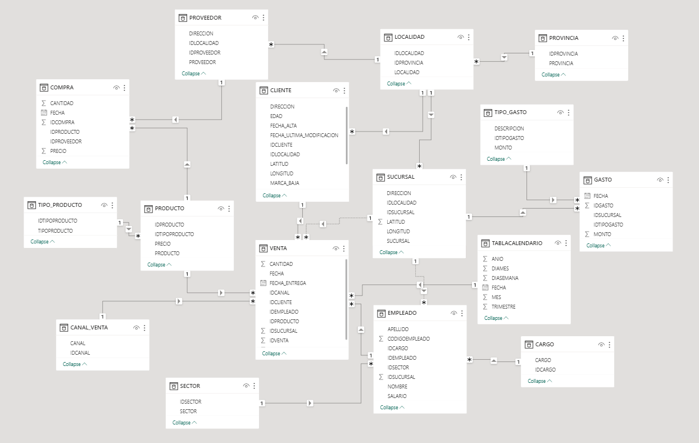

# Data Engineering on SQL Snowflake and AWS

## Resumen del proyecto

En este proyecto vamos a crear un data lake en AWS S3 y un data warehouse en Snowflake. Para ello, vamos a utilizar un dataset de una tienda de equipo electrónico, que contiene información sobre las ventas clientes proveedores y productos.

Vamos a realizar las transformaciones necesarias para cargar los datos en el data lake y en el data warehouse de snowflake y mediante commandos de SQL vamos a realizar la transformación del data set y dejar una base de datos normalizada.

## Dataset
El data set cuenta con 10 tablas en formatos csv tanto como en xlsx. Las tablas son las siguientes:

- **Canal de venta**: contiene información sobre los diferentes tipos de formas como se puede crear una venta.
- **Clientes**: Una base de datos de los clientes que han realizado compras en la tienda.
- **Compra**: Contiene información sobre las compras realizadas las sucurales de la tienda.
- **Empleados**: Contiene información sobre los empleados de la tienda.
- **Gasto**: Contiene información sobre los gastos fijos realizados por las sucursales de la tienda.
- **Productos**: Contiene información sobre los productos que se venden en la tienda.
- **Proveedores**: Contiene información sobre los proveedores de los productos que se venden en la tienda.
- **Sucursales**: Contiene información sobre las sucursales de la tienda.
- **Tipos de Gasto**: Contiene información sobre los tipos de gastos que se realizan en las sucursales.
- **Venta**: Contiene información sobre las ventas realizadas en las sucursales de la tienda.

## Arquitectura inicial

## Arquitectura final

## ETL

Las transformaciones realizadas en el ETL son las siguientes:

- **Canal de venta**: Se eliminan las columnas `id` y `fecha_creacion` y se renombra la columna `nombre` a `canal_venta`.
  
- **Clientes**: Se formatea las columnas de latitud y longitud a float , se renombra la columna `id` a `id_cliente` y se crean las tablas de dimensiones localidad y provincia.
  
- **Cargo**: Se crea la tabla de dimensiones cargo.
  
- **Compra**: Se crean las conexiones con proveedores y productos y se renombra la columna `id` a `id_compra`.
  
- **Empleados**: Se crea un nuevo identificador `CodigoEmpleado` con un procedure para que sea autoincremental para evitar la duplicidad de IdEmpleado, se cambia el nombre de sucursal por un Id sucursal y se formatean las columnas de sucursal para hacer match al 100% con la tabla sucursal.

- **Gasto**: Se crea la tabla de dimensiones tipo_gasto y se renombra la columna `id` a `id_gasto`.

- **Localidad**: Se crea la tabla de dimensiones localidad.

- **Productos**: Se crea normaliza la tabla creando la tabla tipo_producto y se renombra la columna `id` a `id_producto`.

- **Proveedor**: Se enlaza con las recien creadas tablas de dimensiones localidad y provincia y se renombra la columna `id` a `id_proveedor`.

- **Provincia**: Se crea la tabla de dimensiones provincia.

- **Sector**: Se crea la tabla de dimensiones sector.

- **Sucursal**: Se formatea las columnas `X` y `Y` a float se les renombra a `latitud` y `longitud` respectivamente, se crea la tabla de dimensiones sucursal y se renombra la columna `id` a `id_sucursal`.

- **Tabla Calendario** Mediante un procedimiento en SQL se crea una tabla calendario de dimensiones con las fechas de los años 2018, 2019 y 2020.

- **Tipo de Gasto**: Se renombra la columna `id` a `id_tipo_gasto`.

- **Tipo de Producto**: Se crea la tabla de dimensiones tipo_producto.

- **Venta**: Se renombra la columna `id` a `id_venta` y se crea la tabla de dimensiones canal_venta se normaliza la columna sucursal para hacer el enlace con la tabla sucursal.

Estas transformaciones se encuentran en el archivo `ETL.sql` en la carpeta principal.

## Visualización
Working on the powerBI dashboard
